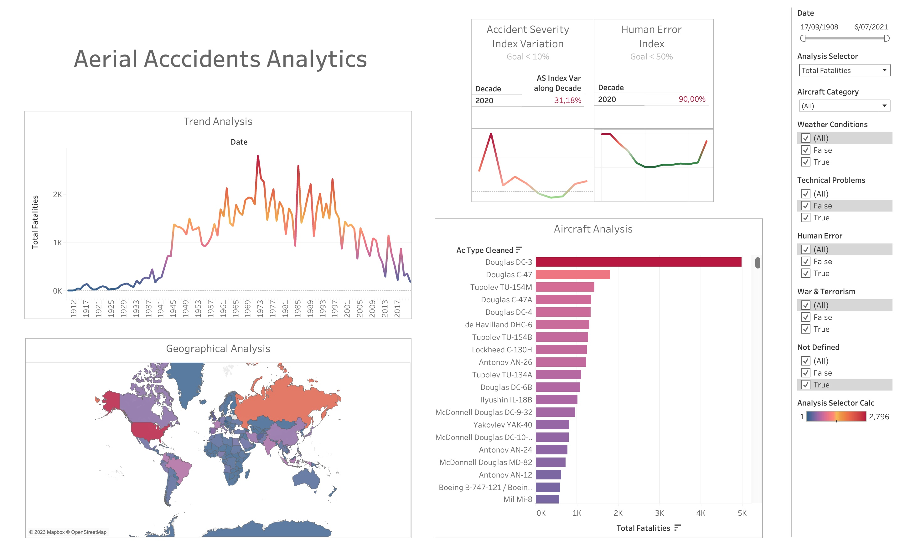

 
 

#  **
Aerial Accidents - Data Analytics
** 

# 
Unlocking Insights in Aviation Safety: Harnessing Data Analytics for Safer Skies

## *1. Introduction & Context*

Aviation accidents are unforeseen and unwelcome events involving aircraft that result in physical harm to individuals or damage to the aircraft itself. Such accidents can encompass a wide range of aircraft, from commercial airplanes and private jets to helicopters, gliders, and hot air balloons. These incidents can be triggered by a multitude of factors, including human errors, equipment malfunctions, adverse weather conditions, maintenance issues, air traffic management failures, design flaws, or manufacturing defects. Their consequences can be profound, affecting not only human lives but also causing significant economic losses.

In response to this critical challenge, the aviation industry, regulatory authorities, and dedicated researchers tirelessly collaborate to enhance aviation safety and prevent future accidents. For organizations connected to the aviation sector, investigating the root causes of accidents and understanding how to avert them in the future is paramount to avoiding loss of life and substantial material damages. This intricate issue highlights the ongoing need for rigorous safety measures, advancements in technology, and improved operational procedures within the aviation industry, ultimately underscoring the crucial importance of aviation safety for both passengers and the industry itself. In the following discussion, we will delve deeper into the various causes and consequences of aviation accidents and explore the initiatives and innovations aimed at reducing the risks associated with air travel. 

As the data analyst for the International Civil Aviation Organization (ICAO), a specialized agency of the United Nations, my mission is to delve into a century's worth of aviation accidents. My primary goal is to conduct an extensive data analysis, coupled with the development of an interactive dashboard to provide insightful visualizations for a comprehensive understanding of these incidents. ✈️✈️📊

## *2. Dataset Description & Dictionary*

To comply with the project objectives, the International Civil Aviation Organization (ICAO) gave us a dataset with the following fields ([Original Dataset](https://github.com/Grisales1803/IProject2_AerialAccidentsAnalytics/blob/main/Dataset/AccidentesAviones.csv)):

1. **Date ('fecha'):** Date of teh accident.
2. **Hour Declared ('HORA declarada'):** Hour of the accident.
3. **Route ('Ruta'):** Arrival or Departure location.
4. **Operator ('operadOR'):** Company that operates the aircraft.
5. **Flight Number ('flight_no'):** Flight Number.
6. **Flight Route ('route'):** Locations of the flight route.
7. **Aircraft Type ('ac_type'):** Aircraft type.
8. **Registration Number ('registration'):** Aircraft registration number.
9. **Serial Number ('cn_ln'):** The meaning of this field is not clear but it is something related with the aircraft type.
10. **All Aboard ('all_aboard'):** Total number of people in the aircraft (passengers + crew).
11. **Passengers Aboard ('PASAJEROS A BORDO'):** Total number of passengers in the aircraft.
12. **Crew Aboard ('crew_aboard'):** Total number of crew people in the aircraft.
13. **Total Fatalities ('cantidad de fallecidos'):** Total number of fatalities in the accident.
14. **Passenger Fatalities ('passenger_fatalities'):** Total number of passenger fatalities in the accident.
15. **Crew Fatalities ('crew_fatalities'):** Total number of crew people fatalities in the accident.
16. **Ground Fatalities ('ground'):** Total number of external fatalities due to the accident.
17. **Accident Summary ('summary'):** Summary of the accident.

## *3. Extraction, Transformation, and Loading (ETL)*

In the realm of data analytics, a robust ETL (Extract, Transform, Load) process is the cornerstone of any successful project, particularly when the goal is to glean insights for preventing aerial accidents. The importance of ETL lies in its capacity to ensure data consistency, accuracy, and reliability. In the context of aviation safety, incomplete or inconsistent data can be disastrous. Without a well-structured ETL, one risks the ingestion of flawed or misaligned data, which can subsequently lead to non-consistent and unreliable decisions.

Inaccurate data can obscure the underlying patterns, making it nearly impossible to identify crucial insights or trends. Therefore, an effective ETL process is not just a technical requirement but a strategic imperative, as it serves as the foundation upon which informed decisions are built. For the prevention of aerial accidents, where every piece of information is invaluable, a meticulous ETL process is non-negotiable. It ensures that the insights derived from the data are accurate, reliable, and, most importantly, capable of informing proactive safety measures to safeguard the aviation industry and the lives of those who rely on it.

Recognizing the critical nature of this endeavor, we meticulously examined each column, pinpointing outliers, rectifying inconsistent data, standardizing formats, and aggregating information. This rigorous process aims to enhance the analytical capabilities within the forthcoming Business Intelligence Tool, which I will discuss in more detail later.

To review in more detail all the ETL process, you can refer to this link: [ETL](https://github.com/Grisales1803/IProject2_AerialAccidentsAnalytics/blob/main/EDA_ETL.ipynb)

## *4. Exploratory Data Analysis (EDA)*

An excellent Exploratory Data Analysis (EDA) plays a pivotal role in our Aerial Accidents Analytics project, serving as the compass that guides us through the wealth of data at our disposal. In this endeavor, we have harnessed various data analysis techniques, including Natural Language Processing (NLP) and word clouds, which have been instrumental in identifying critical keywords within accident summaries. This initial step has enabled us to distill the most pertinent information from a trove of textual data, helping us pinpoint key factors contributing to aviation accidents. By doing so, we have unlocked the potential to uncover hidden insights that can be pivotal in preventing future accidents.

Moreover, our EDA doesn't stop at textual analysis. We have employed a comprehensive array of visual aids, such as pie charts, histograms, box plots, and pair plots, to shed light on the underlying patterns and relationships within the dataset. These graphical representations have not only allowed us to gain a clearer understanding of the data's distribution but have also been invaluable in ensuring data consistency with real-world occurrences. This meticulous process guarantees that the insights we derive are not only accurate but also grounded in the realities of aviation safety, ultimately equipping us with the knowledge to implement targeted safety measures and reduce the occurrence of aerial accidents.

For a comprehensive examination of the entire Exploratory Data Analysis (EDA) process, please feel free to visit the following link: [EDA](https://github.com/Grisales1803/IProject2_AerialAccidentsAnalytics/blob/main/EDA_ETL.ipynb)

## *5. KPI Definition*

Key Performance Indicators (KPIs) are the guiding beacons in our Aerial Accidents Analytics project, essential metrics that illuminate our progress and success in achieving safety goals. These KPIs offer quantifiable insights into various facets of aviation safety, from accident frequency to fatality rates, enabling us to monitor our performance and make informed decisions. They play a pivotal role in guiding our safety strategies, ensuring that we prioritize the most critical areas for improvement, and ultimately steer our efforts towards a safer and more secure aviation industry. In essence, KPIs serve as indispensable navigational instruments, helping us maintain course, adapt to evolving conditions, and chart a path towards enhanced safety outcomes.

In this project we developed two KPIs:

1. The **Accident Severity Index (ASI)** is defined as the total number of crew members who have perished in accidents recorded during the decade under consideration, divided by the total number of aerial accidents occurring in this time period. Its formula is (Total sum of fatalities in the time period / Total sum of accidents in the time period).

This index aids us in assessing the severity of accidents and the objective is to keep it at a minimum. We aim not only to have fewer accidents but also to minimize the number of fatalities worldwide due to this reason. The idea is to keep it below 10%.

2. The **Human Error Index (HEI)** is defined as the ratio of accidents solely attributed to human error and mechanical issues to the sum of accidents resulting from these factors as well as those caused by weather conditions. This metric serves as a valuable tool for evaluating our performance in activities aimed at incident prevention. Human errors can be mitigated through improved training, enhanced operational discipline, standardization of procedures, robust Root Cause Analysis, and learning from past accidents, among other measures. Likewise, technical issues can be addressed by focusing on proactive maintenance, enhanced inspections, adequate spare parts availability, and more. The HEI metric ranges from 0 to 1, with 1 representing the worst-case scenario where human errors and technical issues are solely responsible for accidents. The objective is to maintain this metric below 50%, ideally striving to approach zero, signifying a strong commitment to minimizing incidents and ensuring aviation safety.

## *6. Dashboard*

In light of the considerations outlined above, we have meticulously crafted a Tableau Dashboard designed to unearth invaluable insights, empowering us to make informed decisions and proactively reduce fatalities within the Aerial Industry.

Within this dynamic dashboard, we offer a comprehensive trend analysis for three key variables:

1. Total Fatalities (Fatalities aboard).
2. Ground Fatalities (External fatalities caused by the accident).
3. Number of Accidents.

In addition to these insights, the dashboard provides user-friendly filtering options, allowing you to explore the data with precision. You can filter by:

1. Date.
2. Aircraft Category.
3. Cause Category.

Furthermore, the dashboard showcases a range of data visualizations tailored to enhance decision-making and facilitate meaningful correlations. These visualizations include:

1. Trend Analysis.
2. Geographical Analysis.
3. Aircraft Type Analysis.

For a glimpse of this powerful tool, please refer to the accompanying dashboard image below and follow this link [Dashboard](https://public.tableau.com/app/profile/juan.camilo.grisale.lopez/viz/AerialAccidentsAnalytics/Dashboard1):

  

## *7. Author:*

- Juan Camilo Grisales.
- Mail: [grisales1803@gmail.com](grisales1803@gmail.com)
- LinkedIn : [https://www.linkedin.com/in/grisales1803/](https://www.linkedin.com/in/grisales1803/)
