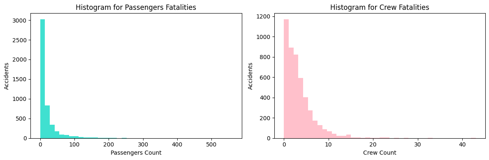
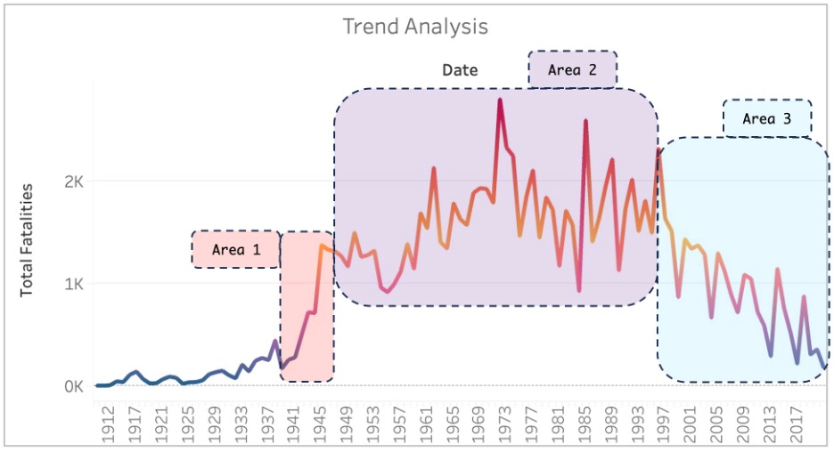

 
 

#  **
Aerial Accidents - Data Analytics
** 

# 
Unlocking Insights in Aviation Safety: Harnessing Data Analytics for Safer Skies

## *1. Introduction & Context*

Aviation accidents are unforeseen and unwelcome events involving aircraft that result in physical harm to individuals or damage to the aircraft itself. Such accidents can encompass a wide range of aircraft, from commercial airplanes and private jets to helicopters, gliders, and hot air balloons. These incidents can be triggered by a multitude of factors, including human errors, equipment malfunctions, adverse weather conditions, maintenance issues, air traffic management failures, design flaws, or manufacturing defects. Their consequences can be profound, affecting not only human lives but also causing significant economic losses.

In response to this critical challenge, the aviation industry, regulatory authorities, and dedicated researchers tirelessly collaborate to enhance aviation safety and prevent future accidents. For organizations connected to the aviation sector, investigating the root causes of accidents and understanding how to avert them in the future is paramount to avoiding loss of life and substantial material damages. This intricate issue highlights the ongoing need for rigorous safety measures, advancements in technology, and improved operational procedures within the aviation industry, ultimately underscoring the crucial importance of aviation safety for both passengers and the industry itself. In the following discussion, we will delve deeper into the various causes and consequences of aviation accidents and explore the initiatives and innovations aimed at reducing the risks associated with air travel. 

As the data analyst for the International Civil Aviation Organization (ICAO), a specialized agency of the United Nations, my mission is to delve into a century's worth of aviation accidents. My primary goal is to conduct an extensive data analysis, coupled with the development of an interactive dashboard to provide insightful visualizations for a comprehensive understanding of these incidents. ✈️✈️📊

## *2. Dataset Description & Dictionary*

To comply with the project objectives, the International Civil Aviation Organization (ICAO) gave us a dataset with the following fields ([Original Dataset](https://github.com/Grisales1803/IProject2_AerialAccidentsAnalytics/blob/main/Dataset/AccidentesAviones.csv)):

1. **Date ('fecha'):** Date of teh accident.
2. **Hour Declared ('HORA declarada'):** Hour of the accident.
3. **Route ('Ruta'):** Arrival or Departure location.
4. **Operator ('operadOR'):** Company that operates the aircraft.
5. **Flight Number ('flight_no'):** Flight Number.
6. **Flight Route ('route'):** Locations of the flight route.
7. **Aircraft Type ('ac_type'):** Aircraft type.
8. **Registration Number ('registration'):** Aircraft registration number.
9. **Serial Number ('cn_ln'):** The meaning of this field is not clear but it is something related with the aircraft type.
10. **All Aboard ('all_aboard'):** Total number of people in the aircraft (passengers + crew).
11. **Passengers Aboard ('PASAJEROS A BORDO'):** Total number of passengers in the aircraft.
12. **Crew Aboard ('crew_aboard'):** Total number of crew people in the aircraft.
13. **Total Fatalities ('cantidad de fallecidos'):** Total number of fatalities in the accident.
14. **Passenger Fatalities ('passenger_fatalities'):** Total number of passenger fatalities in the accident.
15. **Crew Fatalities ('crew_fatalities'):** Total number of crew people fatalities in the accident.
16. **Ground Fatalities ('ground'):** Total number of external fatalities due to the accident.
17. **Accident Summary ('summary'):** Summary of the accident.

## *3. Extraction, Transformation, and Loading (ETL)*

In the realm of data analytics, a robust ETL (Extract, Transform, Load) process is the cornerstone of any successful project, particularly when the goal is to glean insights for preventing aerial accidents. The importance of ETL lies in its capacity to ensure data consistency, accuracy, and reliability. In the context of aviation safety, incomplete or inconsistent data can be disastrous. Without a well-structured ETL, one risks the ingestion of flawed or misaligned data, which can subsequently lead to non-consistent and unreliable decisions.

Inaccurate data can obscure the underlying patterns, making it nearly impossible to identify crucial insights or trends. Therefore, an effective ETL process is not just a technical requirement but a strategic imperative, as it serves as the foundation upon which informed decisions are built. For the prevention of aerial accidents, where every piece of information is invaluable, a meticulous ETL process is non-negotiable. It ensures that the insights derived from the data are accurate, reliable, and, most importantly, capable of informing proactive safety measures to safeguard the aviation industry and the lives of those who rely on it.

Recognizing the critical nature of this endeavor, we meticulously examined each column, pinpointing outliers, rectifying inconsistent data, standardizing formats, and aggregating information. This rigorous process aims to enhance the analytical capabilities within the forthcoming Business Intelligence Tool, which I will discuss in more detail later.

To review in more detail all the ETL process, you can refer to this link: [ETL](https://github.com/Grisales1803/IProject2_AerialAccidentsAnalytics/blob/main/EDA_ETL.ipynb)

## *4. Exploratory Data Analysis (EDA)*

An excellent Exploratory Data Analysis (EDA) plays a pivotal role in our Aerial Accidents Analytics project, serving as the compass that guides us through the wealth of data at our disposal. In this endeavor, we have harnessed various data analysis techniques, including Natural Language Processing (NLP) and word clouds, which have been instrumental in identifying critical keywords within accident summaries. This initial step has enabled us to distill the most pertinent information from a trove of textual data, helping us pinpoint key factors contributing to aviation accidents. By doing so, we have unlocked the potential to uncover hidden insights that can be pivotal in preventing future accidents.

Moreover, our EDA doesn't stop at textual analysis. We have employed a comprehensive array of visual aids, such as pie charts, histograms, box plots, and pair plots, to shed light on the underlying patterns and relationships within the dataset. These graphical representations have not only allowed us to gain a clearer understanding of the data's distribution but have also been invaluable in ensuring data consistency with real-world occurrences. This meticulous process guarantees that the insights we derive are not only accurate but also grounded in the realities of aviation safety, ultimately equipping us with the knowledge to implement targeted safety measures and reduce the occurrence of aerial accidents.

For a comprehensive examination of the entire Exploratory Data Analysis (EDA) process, please feel free to visit the following link: [EDA](https://github.com/Grisales1803/IProject2_AerialAccidentsAnalytics/blob/main/EDA_ETL.ipynb)

### *4.1. Keywords Definition for Accident Contributing Causes:*

In order to obtain the main words of pair of words that we can find in the column "summary", we developed a word cloud model with the following results:

  

Looking at this word cloud, we can observe some words or pair of words that can help us to better understand some categories of causes of the accidents. Also we used Topics Modeling Tools such as **Latent Dirichlet Allocation (LDA)** or **Non-Negative Matrix Factorization (NMF)**. With these keywords and topic modeling, we can have these categories for the causes of the accidents:

1. **Cause Category 1:** Weather Conditions.
2. **Cause Category 2:** Mechanical, Instrumentation or Electrical Failure.
3. **Cause Category 3:** Human Error.
4. **Cause Category 4:** Combat Losses.
5. **Cause Category 5:** Not Defined.

Now, here is a bar chart to explore how many accidents have involved one of these cause categories. It's good to notice that an accident can have one or more cause categories since there could be different contributing causes at the same time:

  

We can see that **Category 1: Weather Conditions** is present in 39.30% of the accidents. The following is **Category 2: Mechanical, Electrical and Instrumentation Failure** with 34.52%. The next one is **Category 3: Human Error** present in 30.11%  of the accidents and **Category 4: Cambat Losses** with 10.10%. **Category 5: Not Defined** is present in 27.50% of the data. We need to keep in mind that one accident could have more than one category.

Now, it's also good to know how is the proportion of accidents with one or more contributing causes. To visualize that, we build a pie chart as follows: 

  

It's evident that the majority of accidents, accounting for 68.1%, fall into a single category, aligning with the anticipated and typical pattern. About 23.1% of accidents involve two categories, while 8% involve three categories, and a mere 0.8% encompass four categories. This distribution reflects the inherent complexity of accidents, often influenced by multiple contributing factors. Such a varied categorization aligns with our expectations and is considered the norm in accident analysis.

### *4.2. Aircraft Type Categories:*

Let's explore the Top 10 aircraft types by number of accidents:

  

We can see that the model that has more accidents is **Douglas DC-3** with more than 300 accidents. While the second in the top 10 have almost 100 accident. Also, we can see that most of the types in the top 10 are from Douglas. This is making an analysis from all time, but we need to filter by dates in order to check the top 10 in different periods of time. We are going to analyze this in more detail with the Business Intelligence Tool in the section 6. 

Now, using **Artificial Intellligence (CHAT GPT)**, we could categorize aircraft types based on their primary use and design characteristics:

1. **Military Fighter Aircraft:** These are combat aircraft primarily designed for air-to-air combat and often have high speeds and maneuverability.

2. **Civilian Passenger Aircraft:** These are commercial airplanes used for transporting passengers. They include various types of airliners used by airlines worldwide.

3. **General Aviation and Private Aircraft:** These include smaller aircraft used for personal, business, or general aviation purposes. They often include private jets, small propeller planes, and recreational aircraft.

4. **Helicopters:** This category encompasses all types of helicopters, including military and civilian models. Helicopters are rotorcraft that can hover and fly vertically.

5. **Vintage Aircraft:** Vintage aircraft refers to older or historic airplanes and aviation technology, often preserved for historical or collector purposes.

6. **Cargo and Transport Aircraft:** These aircraft are designed to transport goods, cargo, or troops. They come in various sizes and capacities for different logistical purposes.

7. **Specialized or Experimental Aircraft:** This category covers unique, specialized, or experimental aircraft that may serve specific purposes, such as research, testing, or specialized missions.

8. **Airships:** Airships are lighter-than-air aircraft that use gases to achieve lift. They are often used for observation, advertising, or specialized purposes.

9. **Unknown:** It was not possible to know about the Aircraft type.

Now, let's make vertical histogram to check the type categories that are more frequent.

  

We can see that most of the accidents occur in civilian aircrafts or in cargo or transport aircraft. However, in the Business Intelligence Tool, we may need to find the correlation between fatalities and number of accidents (KPI 1: Accident Severity Index) to know which aircraft has more severe impact. 

Also, it would be good to explore the composition of the aircrafts categories through a pie chart:

  

The analysis reveals a significant share of accidents occurring in **Civilian Passenger Aircraft**, accounting for 53.8% of incidents. This predominance aligns with the widespread use and prevalence of these aircraft in our skies. **Cargo and transportation aircraft** follow closely behind, constituting 30.7% of accidents. Given their dual role in both cargo transport and occasionally as civilian passenger carriers, their second-place position is proportional to their commonality. **Helicopters** and **Vintage Aircraft** share a similar share of incidents at 4.5%, while **General Aviation & Private Aircraft** account for 3.4% of accidents. This distribution is logical, as these aircraft types are less frequent compared to civilian and transportation categories, maintaining a consistent proportion of accident occurrence. **Military Aircraft** experiences a relatively lower share at 1.6%, a somewhat unexpected finding considering combat losses. **Specialized Aircrafts** occupy the last position with 0.7%, reflecting their uncommon usage. Finally, there's a relatively minor proportion of **Unknowns**, underscoring the quality and reliability of our dataset for data-driven decision-making.

### *4.3. Distribution of `all_aboard` column:*

  

As illusrated, less accidents with less people aboard. This can tell us that most of the accidents were in aircrafts with reduced occupants capacity, like small aiplanes, business jets, military jets, experimental aircrafts, helicopters, gliders and amphibious aircrafts. It's evident that aircrafts with less than 20 people represents 2822 accidents of the datasets that has 5008 records. Which represents the 56% of the dataset. Let's check the top 10 aircraft types involved. 

  

We can see almost the same behaviour as the all time analysis. Also, we can see that all these aircrafts are very small for less than 21 to 30 passengers. Let's check by category:

  

As we can observe, it follows the same pattern at the top three category for the whole dataset. We will explore more about this in the Business Intelligence Tool. Finally, it's good to explore through a box plot if there are any outliers and if there is a logical explanation for that.

  

We can see that there are some data with values higher than 500 people aboard. Those values are real and possible since those types of Boing have this capacity. There are not outliers in this column.

### *4.4. Distribution of `passengers_aboard` and `crew_aboard` columns:*

  

Here we can see a behaviour that tells us that there is a peak of accidents when the crew has between 2 to 4 people. This confirms that tha majoritiy of the accidents occurred with small airplanes that require few people in the crew team. However, we can see more accidents in this type of aircrafts than the ones flown by one single pilot. 

  

We can observe in the passengers the same behaviour as the total_aboard column but we can see records where the crew are more than 30 people. Most of them are military an not commercial and it is normal to have all crew members on flight, without any passengers. There are not outliers for both of these columns.

### *4.5. Distribution of `total_fatalities` column:*

  

As illustrated, fortunately most of the accidents involve less than 20 fatalities. This observation underscores the notion that most accidents involve small aircraft, which may not adhere to the same rigorous safety standards as larger airplanes. Nevertheless, it's crucial to emphasize that every life is valuable, and our collective efforts must be dedicated to the goal of achieving zero aerial accidents in the future. Now, let's review outliers through a box plot:

  

We can see the same high values that we reviewed for the column total_aboard. There are not outliers for this column.

### *4.6. Distribution of `passengers_fatalities` and `crew_fatalities` columns:*

  

In these histograms we can observe that most of the accidents occur when there ae few passengers. Most of them happpens with more crew-passengers proportion: small aircrafts. Now, let's review outliers through a box plot:

  

We can see the same behavior as the 'aboard' variables. There are no outliers here.

### *4.7. Distribution of `ground_fatalities` column:*

  

In this histogram we can see that in almost all the accidents, ground fatalitites are less than 200 fatalities. However, we can see that the ground fatalities label goes to 3000, which represents the abnormal value of 2750. Now, let's review outliers through a box plot:

  

As expected we have the abnormal values at 2750. These values refer to the fatalities in the worst aerial accident in the history: The terrorist attack to the twin towers in New York on september, 11th, 2001.

### *4.8. Relationship between `passenger_fatalities`, `passengers_aboard`, `crew_fatalities`, `passenger_aboard`:*

  

This pairplot reveals the following insights:

1. Two accidents exhibit a paradoxical pattern with a higher count of passenger fatalities than the total number of passengers on board. Such a scenario is logically impossible, as fatalities cannot exceed the passenger count.
2. Similarly, two instances display a conflicting situation where crew fatalities surpass the number of crew members aboard, defying the laws of aviation safety.
3. An interesting observation can be made in the scatter plot of passengers_aboard versus crew_aboard, where an imaginary boundary is discernible. This boundary indicates a minimum passenger-to-crew ratio, reinforcing the expected notion that a certain minimum number of crew members is necessary to support a given number of passengers.
4. In the remaining plots, no discernible relationship exists between the paired variables.

### *4.9. Relationship between `total_fatalities` and Cause Categories:*

  

We observe that each category contains an outlier represented by accidents that exhibit all categories as contributing causes. However, it's important to note that there are not four separate accidents; rather, there are two distinct incidents.

The first major accident, resulting in nearly 580 fatalities, is attributed to weather conditions (Category 1) and combat loss (Category 4) as the primary causes. In contrast, the second incident, involving nearly 520 fatalities, is primarily attributed to mechanical, electrical, or instrumental failure (Category 2) and human error (Category 3) as the main contributing factors.

## *5. KPI Definition*

Key Performance Indicators (KPIs) are the guiding beacons in our Aerial Accidents Analytics project, essential metrics that illuminate our progress and success in achieving safety goals. These KPIs offer quantifiable insights into various facets of aviation safety, from accident frequency to fatality rates, enabling us to monitor our performance and make informed decisions. They play a pivotal role in guiding our safety strategies, ensuring that we prioritize the most critical areas for improvement, and ultimately steer our efforts towards a safer and more secure aviation industry. In essence, KPIs serve as indispensable navigational instruments, helping us maintain course, adapt to evolving conditions, and chart a path towards enhanced safety outcomes.

In this project we developed two KPIs:

1. The **Accident Severity Index (ASI)** is defined as the total number of crew members who have perished in accidents recorded during the decade under consideration, divided by the total number of aerial accidents occurring in this time period. Its formula is (Total sum of fatalities in the time period / Total sum of accidents in the time period).

This index aids us in assessing the severity of accidents and the objective is to keep it at a minimum. We aim not only to have fewer accidents but also to minimize the number of fatalities worldwide due to this reason. The idea is to keep it below 10%.

2. The **Human Error Index (HEI)** is defined as the ratio of accidents solely attributed to human error and mechanical issues to the sum of accidents resulting from these factors as well as those caused by weather conditions. This metric serves as a valuable tool for evaluating our performance in activities aimed at incident prevention. Human errors can be mitigated through improved training, enhanced operational discipline, standardization of procedures, robust Root Cause Analysis, and learning from past accidents, among other measures. Likewise, technical issues can be addressed by focusing on proactive maintenance, enhanced inspections, adequate spare parts availability, and more. The HEI metric ranges from 0 to 1, with 1 representing the worst-case scenario where human errors and technical issues are solely responsible for accidents. The objective is to maintain this metric below 50%, ideally striving to approach zero, signifying a strong commitment to minimizing incidents and ensuring aviation safety.

## *6. Dashboard*

In light of the considerations outlined above, we have meticulously crafted a Tableau Dashboard designed to unearth invaluable insights, empowering us to make informed decisions and proactively reduce fatalities within the Aerial Industry.

Within this dynamic dashboard, we offer a comprehensive trend analysis for three key variables:

1. Total Fatalities (Fatalities aboard).
2. Ground Fatalities (External fatalities caused by the accident).
3. Number of Accidents.

In addition to these insights, the dashboard provides user-friendly filtering options, allowing you to explore the data with precision. You can filter by:

1. Date.
2. Aircraft Category.
3. Cause Category.

Furthermore, the dashboard showcases a range of data visualizations tailored to enhance decision-making and facilitate meaningful correlations. These visualizations include:

1. Trend Analysis.
2. Geographical Analysis.
3. Aircraft Type Analysis.

For a glimpse of this powerful tool, please refer to the accompanying dashboard image below and follow this link [Dashboard](https://public.tableau.com/app/profile/juan.camilo.grisale.lopez/viz/AerialAccidentsAnalytics/Dashboard1):

  

### *6.1. Trend Analysis:*

In the Dashboard we can see three areas of analysis fot the Number of Accidents and Total Fatalities:

  

  

**1. Area 1 (From 1933 to 1945):** A notable pattern emerges when we analyze the data – a significant peak in the number of accidents and fatalities coincides with the Second World War. Prior to this era, civil transportation aircraft witnessed a higher frequency of accidents. However, from 1942 onwards, the majority of accidents occurred in cargo and transportation aircraft. This shift is logical, as the focus during the war years was on winning, leading to extensive use of aerial transportation for the conveyance of essential supplies such as food, weaponry, and troops. This period was marked by a notable increase in both the number of accidents and fatalities. Additionally, it's worth noting that in 1944, the International Civil Aviation Organization (ICAO) was established during the Chicago Convention. Since its inception, ICAO has played a pivotal role in setting new standards and recommended practices known as SARPs.

**2. Area 2 (From 1945 to 1995):** A consistent pattern emerges in the number of accidents over the years, with occasional surges in the fatality count. This trend is logical, considering the progressive expansion of aircraft capacity over time, which increases the potential for more fatalities in the event of an accident. Notably, during this period, 18 annexes were introduced to complement the SARPs, yet none of them explicitly prioritized safety as the organization's core value. Safety was implicitly embedded in these standards, but there wasn't a dedicated standard solely focused on safety as a central tenet. This aspect may elucidate the sustained stability in the accident and fatality figures during these years. Please refer to the [ICAO's Safety Report for 2019](https://www.icao.int/safety/Documents/ICAO_SR_2019_final_web.pdf) for more information about these milestones.

**3. Area 3 (From 1996 to 2001):** Upon reviewing the [ICAO's Safety Report for 2019](https://www.icao.int/safety/Documents/ICAO_SR_2019_final_web.pdf), a pivotal turning point emerges in aviation safety trends. In 1997, the International Civil Aviation Organization (ICAO) introduced the Global Aviation Safety Plan (GASP), heralding a remarkable transformation in the trajectory of fatalities and accident numbers. This strategic plan was designed to prioritize and continuously enhance aviation safety. It marked a significant shift, where safety assumed the foremost position within the organization, eventually permeating the entire aviation industry as a cultural norm. Subsequently, in 1999, the Universal Safety Oversight Audit Programmes (USOAP) were initiated to assess the safety oversight capabilities of states, forming a crucial element of the Global Aviation Safety Framework. In 2001, Standards and Recommended Practices (SARPs) related to Safety Management were incorporated into Annexes 6, 11, and 14. The year 2006 witnessed the launch of the Safety Management Manual. Finally, in 2013, Annex 19 was unveiled, titled "Safety Management Consolidated." These progressive developments, alongside subsequent measures, substantially contributed to a marked reduction in both the frequency of accidents and fatalities. This example underscores the profound impact of prioritizing safety as a core value across all industries, ultimately leading to the preservation of countless lives.

### *6.2. Geographical Analysis:*

  

It's evident that the United States and Russia stand out as the leading countries with the highest frequency of aviation accidents and fatalities. Given their prominent positions in the aviation industry, it's reasonable to attribute these statistics to the sheer volume of flights originating from these nations. For future research, it would be valuable to incorporate data on the total number of flights per year for each country. This additional metric would enable a more equitable comparison among countries and facilitate a clearer understanding of which ones experience a higher rate of accidents or fatalities per flight.

### *6.3. Aircraft Analysis:*

  

The Douglas DC-3 emerges as the aircraft with the highest incidence of accidents and fatalities, which can be attributed to its unparalleled popularity throughout aviation history. This aircraft, in production from 1933 to 1942, has maintained its prominence and is still in use today, even after nearly 80 years since production ceased. Its enduring use is primarily driven by its unique capability to access remote and challenging terrain, particularly in areas with poorly maintained runways. Given the advanced age of these aircraft, it is unsurprising to observe a notable frequency of accidents and fatalities, a trend that persists to the present day.

  

### *6.4. KPI 1 Analysis:*

  

As mentioned earlier, this Key Performance Indicator (KPI) provides insight into the severity of accidents by dividing the total number of fatalities by the number of accidents. Our objective is to witness a decreasing severity over the decades. However, when assessing the variation between the 2010s and the 2020s, we observe an alarming increase of 31.18%. Our target is to maintain this variation below 10%. These findings underscore the importance of vigilance and highlight that, despite substantial reductions in both accidents and fatalities since 1994, we have witnessed a rise in accident severity over the past decade. This underscores the ongoing need to prioritize safety as the cornerstone of the aviation industry and not lower our guard.

### *6.5. KPI 2 Analysis:*

  

As previously mentioned, this Key Performance Indicator (KPI) aims to distinguish between accidents caused by factors within our control, such as human error and technical issues, and those attributed to uncontrollable factors, specifically weather conditions. To gain a clearer understanding, we can apply a filter on the dashboard to assess the total fatalities specifically in accidents resulting from human error or technical problems:

  

In the trend analysis, it becomes evident that fatalities have been on the rise in recent years when we focus solely on accidents attributed to Human Error or Technical Problems. This upward trend may account for the Human Error Index reaching 90% in the last decade of 2020. Our target for this Key Performance Indicator (KPI) is to maintain it at or below 50%. This threshold signifies that we aim to have a balance between accidents caused by factors within our control (like human error and technical issues) and those influenced by less controllable elements, such as weather conditions.

These two Key Performance Indicators (KPIs) underscore the significant progress we've made in enhancing safety. Nevertheless, they also highlight the ongoing journey toward achieving the ultimate goal of "Zero" accidents. To continue on this path, it's imperative to maintain rigorous audits across all states to assess the extent of SARPs implementation.

Moreover, in-depth accident investigations are crucial to developing robust action plans aimed at preventing future incidents. The recent uptick in accidents stemming from human error or technical issues emphasizes the need for ongoing research and development to advance technology, ultimately reducing the margin for human error. As we standardize our practices further, we minimize room for decision-making errors.

## *7. Conclusions*

In the pursuit of enhancing aviation safety and preventing future aerial accidents, our data analytics project has yielded significant insights and conclusions:

- **Data Reliability and ETL Process:**
  A robust Extract, Transform, Load (ETL) process is essential for ensuring data accuracy and reliability, as incomplete or inconsistent data can lead to unreliable decisions. We have meticulously examined and processed the data, enhancing its reliability for analysis.
- **Exploratory Data Analysis (EDA):**
  Our EDA techniques, including Natural Language Processing (NLP), visualizations, and data summaries, have enabled us to uncover critical insights. These insights encompass factors contributing to aviation accidents, accident trends over the decades, and key aircraft and geographic characteristics associated with accidents.
- **Key Performance Indicators (KPIs):**
  We've established two KPIs to monitor our progress in improving aviation safety: the Accident Severity Index (ASI) and the Human Error Index (HEI). These KPIs provide quantifiable measures of accident severity and the proportion of accidents attributable to human error and technical issues.
- **Dashboard:**
  The Tableau dashboard we've developed provides a dynamic and user-friendly interface for exploring the data and gaining insights. It allows for trend analysis, geographical analysis, and examination of specific aircraft types. The dashboard also highlights our KPIs, facilitating the assessment of safety performance.

## *8. Recommendations*

To continue progressing toward safer skies and reducing aviation accidents, we offer the following recommendations:

- **Ongoing Data Collection and Analysis:**
  Continuous data collection and analysis are crucial for staying up to date with evolving trends in aviation accidents. We recommend that the International Civil Aviation Organization (ICAO) and other relevant authorities maintain and regularly update databases to support informed decision-making.
- **Enhanced Safety Measures:**
  Prioritize safety as a core value within the aviation industry. Continue efforts to reduce accident severity, ideally striving to maintain the Accident Severity Index (ASI) below 10%. This involves rigorous audits of states to assess the implementation of Standards and Recommended Practices (SARPs) and in-depth accident investigations.
- **Focus on Human Error Mitigation:**
  Given the recent increase in accidents attributed to human error or technical issues, it is imperative to invest in research and development to advance technology and minimize the margin for human error. Improved training, enhanced operational discipline, standardized procedures, and learning from past accidents are all measures to consider.
- **International Collaboration:**
  Promote international collaboration and information sharing to collectively improve aviation safety. The aviation industry should continue to work closely with regulatory authorities, researchers, and other stakeholders to drive safety initiatives.
- **Review of Accident-Causing Factors:**
  Consider a comprehensive review of accident summaries to identify recurring themes and causal factors. Utilize advanced analytics and machine learning to detect patterns and potential precursors to accidents.
- **Data Transparency:**
  Increase data transparency by providing additional context, such as the number of flights per year for each country. This will enable a more equitable comparison of accident and fatality rates among countries.
- **Communication and Reporting:**
  Communicate findings and insights to all relevant stakeholders, including aviation companies, regulatory authorities, and the public. Comprehensive and accessible reporting of safety data will promote greater awareness and accountability within the industry.

In conclusion, our data analytics project offers valuable insights into aviation safety and provides a foundation for informed decision-making. By implementing these recommendations and maintaining a steadfast commitment to safety, we can work together to create safer skies and reduce the occurrence of aerial accidents.

## *9. Requirements*

**1. Python** (ETL & EDA)
- Pandas.
- Numpy.
- Matplotlib.
- Spacy.
- Scikit Learn.
- Re.
- Datetime.
- Seaborn.

**2. Tableau** (Business Intelligence Tool)

## *10. Author*

- Juan Camilo Grisales.
- Mail: [grisales1803@gmail.com](grisales1803@gmail.com)
- LinkedIn : [https://www.linkedin.com/in/grisales1803/](https://www.linkedin.com/in/grisales1803/)
